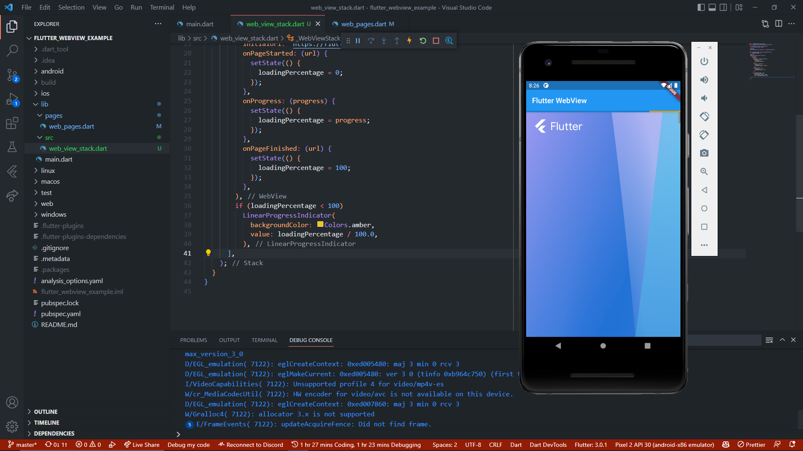
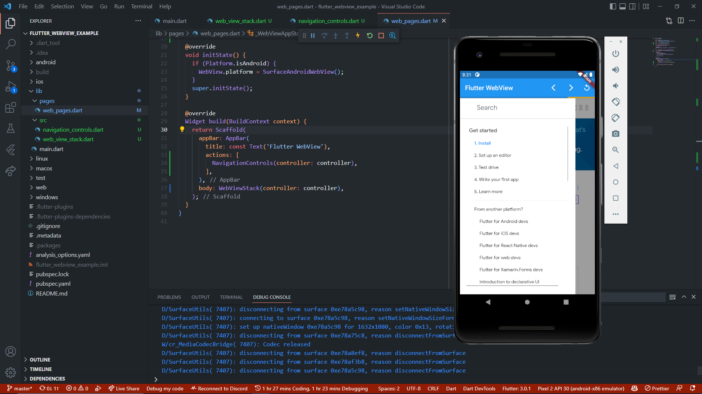
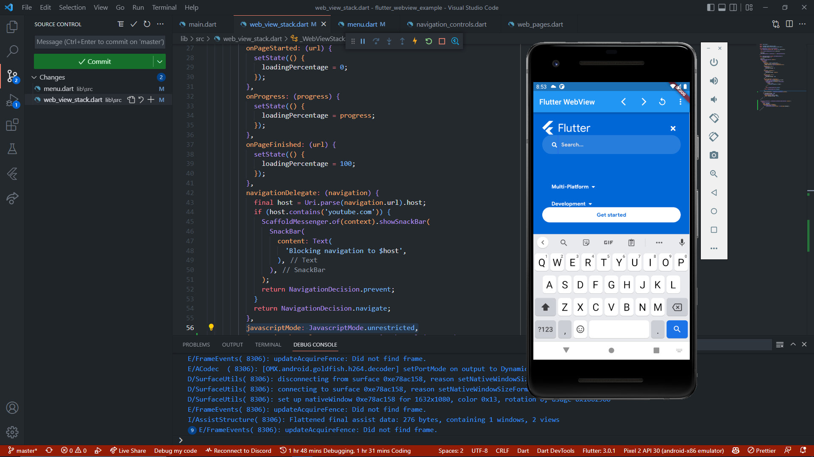
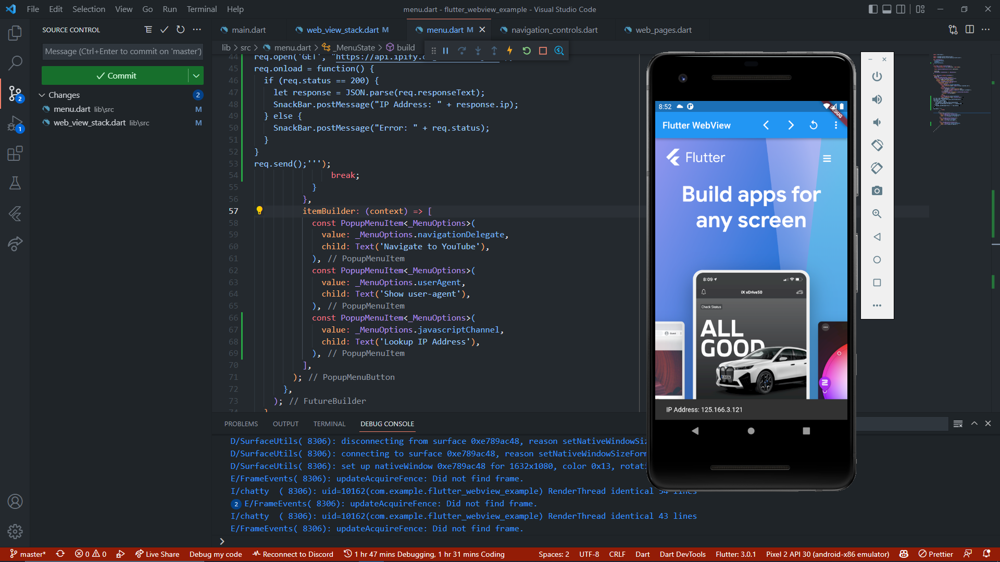
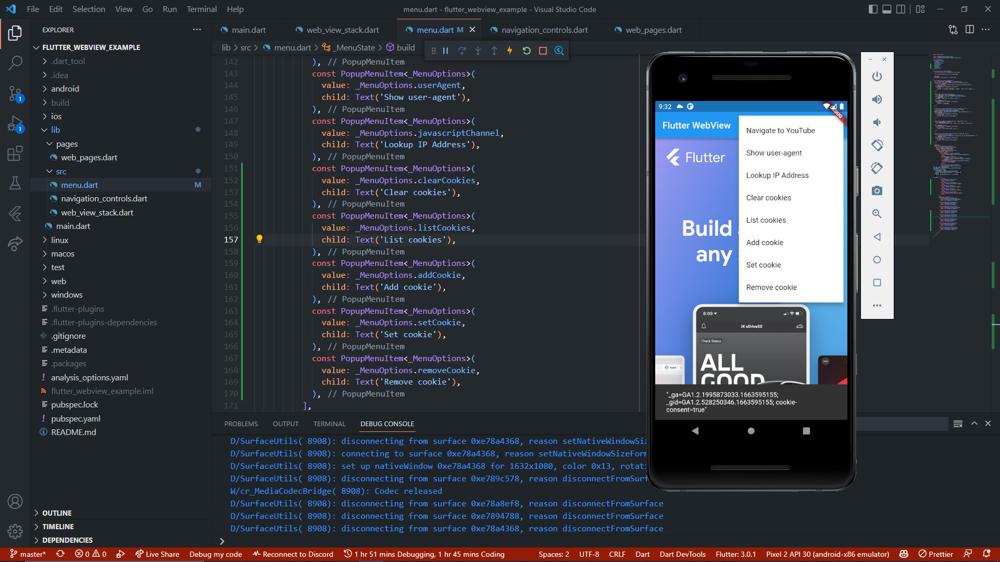
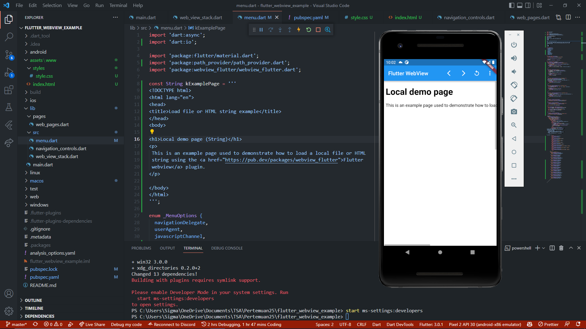

# flutter_webview_example

Praktikum pertemuan 25 TSA Mobile Flutter Program - Flutter Webview

### Praktikum 1

### Praktikum 2

### Praktikum 3

### Praktikum 4

### Praktikum 5

### Praktikum 6

## Preview

<!--  -->

# Resources

- [Flutter Webview Plugin](https://pub.dev/packages/flutter_webview_plugin)
- [Path Provider](https://pub.dev/packages/path_provider)

# References

- [Flutter Webview] (https://codelabs.developers.google.com/codelabs/flutter-webview)
